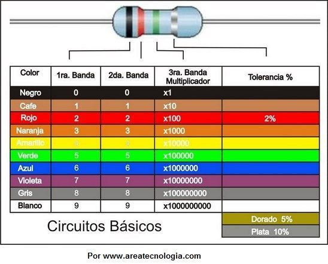
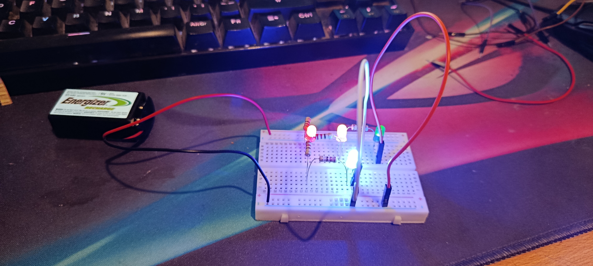
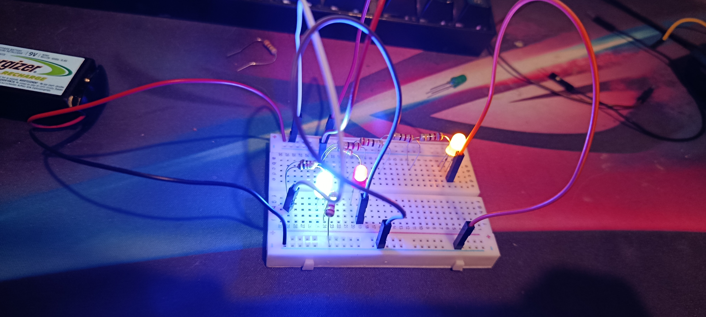
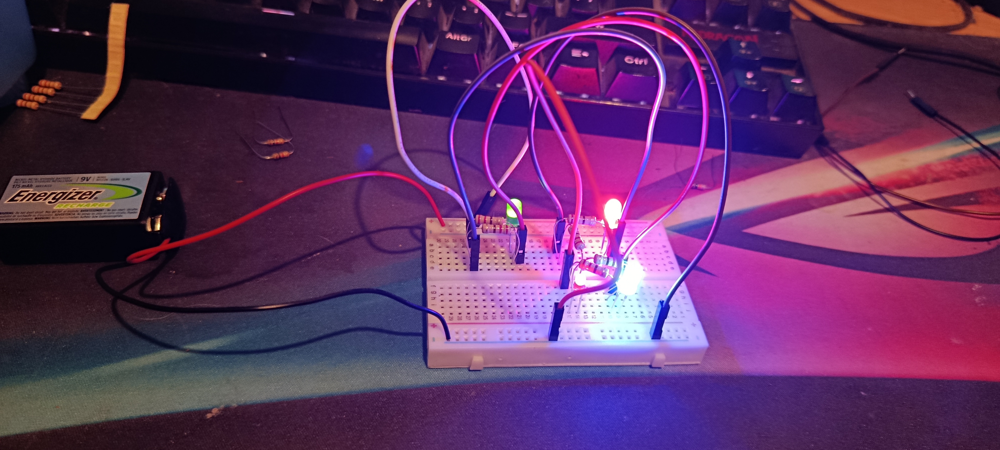
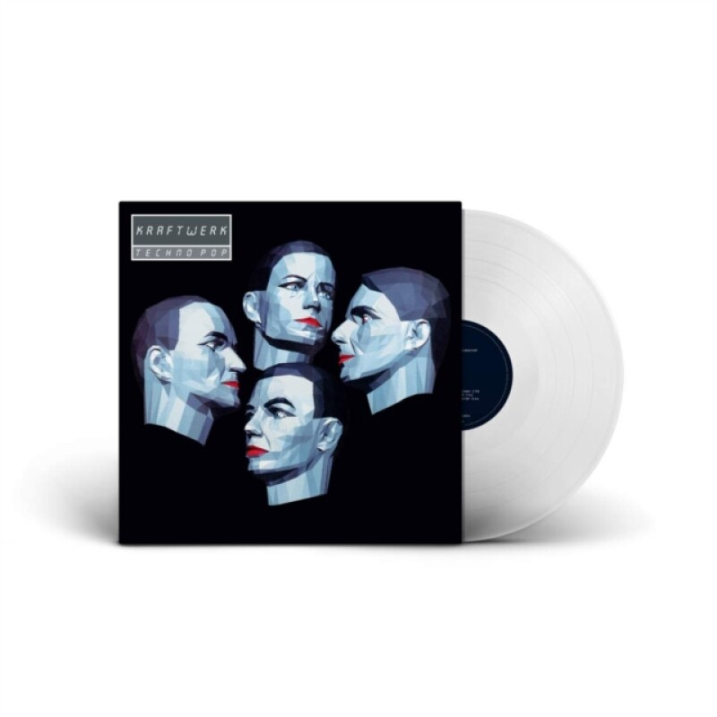
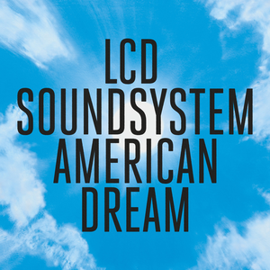

# sesion-02a

## Apuntes clase viernes 17.03.2026

En esta clase se habló sobre las resistencias, el por qué tiene colores y que significan estos y en que se diferencian. Cada color indica algo diferente pero que en su total hace cuando es el numero de la resistencia, es decir dos de esos colores que suelen ser los primeros dos indica cual es el digito, y en el tercer color nos dira cuanta cantidad de ceros lleva el total de la resistencia, nota adicional el dorado o plata equivale a la tolerancia. Y con esto podemos saber cuanto equivale la resistencia, tambien hay paginas o una app en concreto con la que podemos calcular esto con mas facilidad, la aplicación se llama **Electrodoc**

 

**imagen explicativa de valores y cada color resistencia**

También en la clase nos pasaron nuestros materiales en una caja, en el cual estan varios componentes, como los cables, una protoboard, un parlante en mi caso, resistencias, bateria, leds. Con esto durante la clase fuimos haciendo y aprendiendo mas sobre circuitos, en donde se conecto primero la resistencia, luego la led, siguiente paso fue conectar los cables, y posteriormente conectar la energia para que si se hizo todo bien la led se encienda, luego en la clase vimos como poder leer planos tecnicos y aprender como a travez de esos planos poder conectar por cuenta propia a la protoboard, el como tambien se conectan los mismos componentes al plano, la idea es que claramente durante las proximas clases nosotros podamos leer estos planos sin mucha ayuda y tambien saber como hacerlos.

        
  
    

 

**Imagenes de proceso y materiales**

Y como a modo de repaso en lo digital, aprendimos a poner imagenes en github y un poco más como funciona esta misma, lo que es brunch y que tenemos de tener cuidado a no crear un brunch por error. Para poder poner imagenes, se debe cargar primero la imagen en la carpeta de imagenes, recomendable poner un nombre a la imagen antes de subirla, y luego de haber subido la imagen o las imagenes que queramos subir debemos poner el comando.

## Encargo 02 

## LQXTLC

### Ejercicio 1 

| loquitoportilocoloco  | D1    | D2    | D3    | D4    |
| ---                   | ---   | ---   | ---   | ---   |
| R1                    |     0 |     0 |     0 |     0 |
| R3                    |    1  |     1 |     0 |     1 |
| R4                    |    1  |     1 |     1 |     0 |
| R2                    |     0 |     0 |     0 |     1 |
| R5                    |     0 |    0  |  0    |   1   |

**Imagen proceso**

### Ejercicio 2 

| loquitoportilocoloco | D1 | D2 | D3 |
| -------------------- | -- | -- | -- |
| R1                   | 1  |  0 |  1 |
| R2                   |  1 |  0 |  1 |
| R3                   | 1  | 0  |  1 |
| R4                   |  1 |  0 |  1 |
| R5                   |  0 |  1 |  1 |
| R6                   |  1 |  1 |  1 |
| R7                   |  1 |  1 |  1 |
| R8                   |  1 |  1 |  0 |

**Imagen proceso**

### Ejercicio 3

| loquitoportilocoloco | D1 | D2 | D3 | D4 |
| -------------------- | -- | -- | -- | -- |
| R1                   |  1 |  1 |  1 |  1 |
| R2                   |  1 |  1 |  1 |  1 |
| R3                   |  1 |  1 |  0 |  1 |
| R4                   |  1 |  0 |  1 |  0 |
| R5                   |  1 |  1 |  1 |  1 |
| R6                   |  1 |  1 |  1 |  1 |

**Imagen proceso**

## Segunda parte del encargo 

### Kraftwerk

El disco que yo elegi para escucha fue el de Techno Pop, el cual me fui escuchando de vuelta para mi casa cuando sali de la universidad un dia jueves en la tarde, el por qué elegi ese disco es porque vi su nombre y me llamo más la atencion ya que me suele gustar el techno, pero creo que no era nada a lo que me esperaba o a lo que estoy acostumbrada a escuchar, si bien obviamente se escuchaba sintetizadores y musica mas digital, pero sus letras son lo que me hicieron sorprenderme. Mientras iba en el metro camino a mi casa senti como si estuviera en una disco, pero no la tipica disco que se conoce aca en Chile, sino como si estuviera en algun pais de Europa en donde no existe el reggeaton, donde hay musica alternativa o techno contemporaneo, esa fue mi sensacion al escuchar este disco, un disco que tambien es inmersivo, en donde te puedes desconectar un rato de lo que pasa a tu alrededor y fijarte en lo que estas escuchando.
Krafwerk son un grupo que vienen de Alemania, utilizan secuencias, programaciones y efectos de sonidos para sus composiciones, Los integrantes se conocieron cuando estudiaban en la academia Remscheid, y esto empezo ya que en un curso decidieron experimentar un poco y que despues de probar con amplificadores y los primeros teclados electronicos de esos años, porque estamos hablando de los años 1970, se nombraron como Kraftwerk. 
Kraftwerk se ha ido adaptando con el ritmo en los tiempos, hasta que llegaron a este disco Techno pop, ya que de hecho este disco fue el primer que sacaron en formato CD.

### LCD Soundsystem 

En este caso elegi el disco de American dream, y por el contrario de lo que paso con Kraftwerk que me senti más motivada, o con la sensacion de querer estar en una disco como la blondie, que seria lo más parecido, acá lo que me paso que lo senti un ritmo más relajado, en donde facilmente seria musica que escucharia para hacer trabajos y asi no estresarme tanto. pero no por eso significa que sea malo, al contrario, creo que hace un contraste grande teniendo en cuenta que lo escuche despues de Kraftwerk, y siento que hizo una diferencia grande para formar esa tranquilidad luego de una motivacion, unos ritmos mas tranquilos siguiendo siendo de musica tambien digital se podria decir. Mi experciencia con este disco fue muy agradable y lo disfrute mientras descansaba en mi pieza y en mi cama.

### Fuentes 

* Ministerio Federal de Relaciones Exteriores de Alemania. (2012, diciembre 4). Kraftwerk: música y obra de arte total. https://alemaniaparati.diplo.de/mxdz-es/aktuelles/kraftwerk-1086054
