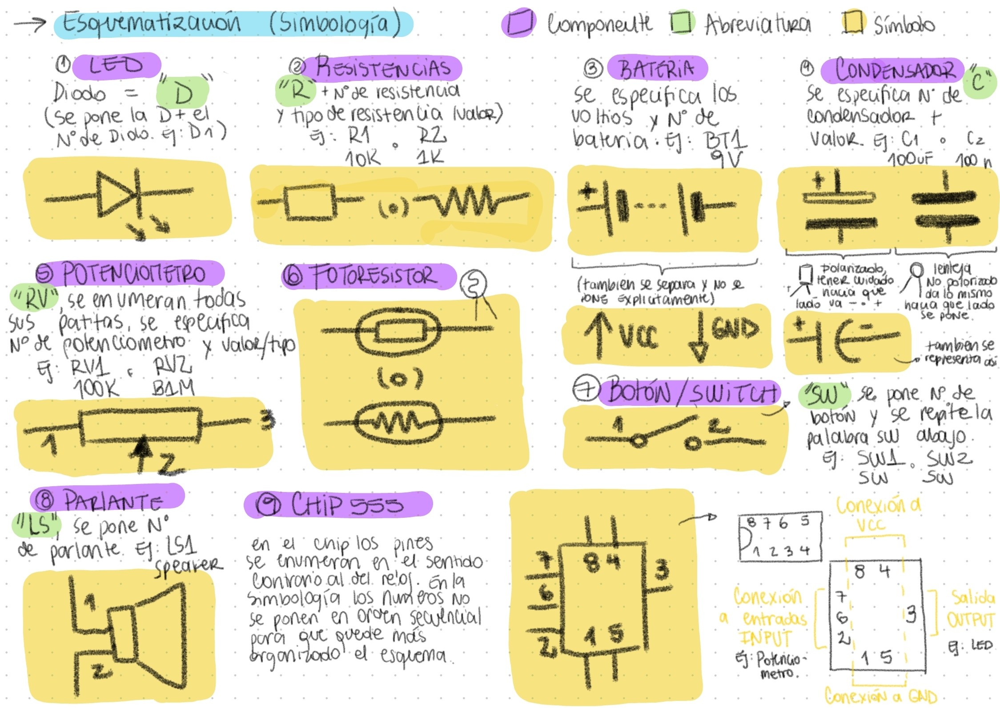
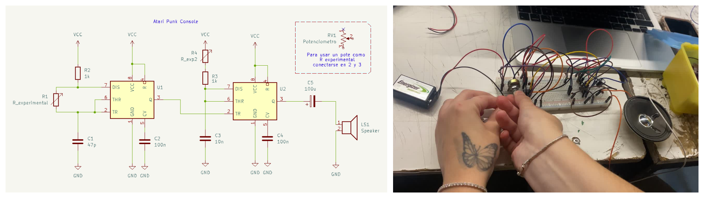

# sesion-03b

Viernes 27 de Marzo, 2026. 

Nota del día: No fui a clases porque tenía licencia, así que todo el contenido general de esta sesión lo saqué de la bitácora de mis compañerines. 

## Referentes (y otras cosas)

- **Yto Aranda** _"La obra de Yto Aranda, centrada fuertemente en comunicación y desarrollo de comunidades, logra recuperar un rol mediador de la tecnología entre el arte, la naturaleza y las personas, constituyéndose en referencia central para comprender la escena transmedial nacional y latinoamericana."_ - <https://yto.cl/> / <https://www.instagram.com/ytoaranda/>
- **editoriales O'Reilly / O'Reilly Media** es una de las editoriales más influyentes en el mundo de la tecnología y la informática. La editorial se especializa en proporcionar herramientas de aprendizaje para profesionales de la tecnología y los negocios. 
- **555-timer-circuits** Según gemini es un recurso técnico (web) especializado en el circuito integrado 555, que detalla sus modos de operación astable, monoestable y biestable. El sitio proporciona esquemáticos para proyectos prácticos, herramientas de cálculo de componentes y configuraciones de pines para el CI 555. (Se puede encontrar información, como información técnica del chip 555 (voltajes, lógicas de funcionamiento, etc), historia, circuitos para construir, etc) - <https://www.555-timer-circuits.com>
- **Forrest Mims** fue un divulgador de electrónica en los años 70. Figura legendaria en el mundo de la electrónica recreativa, famoso por enseñar a generaciones de ingenieros y aficionados a través de sus cuadernos de notas dibujados a mano. A diferencia de los libros de texto densos, Mims publicó guías publicadas por Radio Shack que consistían en diagramas esquemáticos escritos a mano con una caligrafía perfecta y explicaciones sencillas.
- **RadioShack** es una de las marcas más icónicas en la historia de la electrónica de consumo, conocida por ser el "templo" de los aficionados y entusiastas del DIY (hazlo tú mismo) durante gran parte del siglo XX.

## Qué aprendí hoy 

### Conceptos para complementar busquedas de información sobre chips, circuitos o similares: 

- **Handbooks:** Son libros teóricos y prácticos extensos. No se centran en un solo chip, sino en una tecnología completa (ej. Handbook de Diseño de RF). Explican conceptos fundamentales, fórmulas de diseño y estándares de la industria.
- **Cookbooks:** Son guías orientadas a la solución de problemas específicos. Contienen "recetas" o diagramas de circuitos probados que puedes copiar y pegar en tu diseño (ej. Op-Amp Cookbook). Son ideales si buscas configuraciones estándar como filtros o amplificadores.
- **Manual reference:**  (Manuales de referencia / RM) Es el documento "sagrado" para programadores y diseñadores de sistemas. A diferencia del Data Sheet, el RM se enfoca en el funcionamiento interno (registros, mapas de memoria y periféricos). Es indispensable para escribir drivers o firmware.
- **Data Sheets:** Es el documento técnico específico de un componente (ej. un microcontrolador específico). Incluye los límites de voltaje, consumo de corriente, asignación de pines (pinout) y características eléctricas máximas para que no quemes el componente.

### Simbología

Resumen de las abstracciones simbólicas de cada componente visto hasta la fecha: 

### Repaso

- **Resistencia Equivalente (Req)**: La resistencia equivalente es el valor único que reemplaza varias resistencias en un circuito, manteniendo el mismo efecto eléctrico.
- **Circuito en serie**: La corriente es la misma en todas las resistencias, por lo que se suman directamente
- **Circuito en paralelo**: El voltaje es común, y se calcula con la suma de los recíprocos
- **Chip 555**: (definición en palabras simples dada en la clase) El 555 es un timer, es decir, recibe una corriente constante y la transforma a una intermitente, su frecuencia varía de como se configure con cada patita.
- **Monoestable**: Necesita un disparo externo y solo genera un pulso. Es como un cronómetro que se activa solo cuando lo disparas. 
- **Astable**: No tiene estado estable, oscila continuamente y produce una señal periódica (onda cuadrada). Es como un metrónomo que nunca se detiene.

### Atari Punk Console

Según gemini, La Atari Punk Console (APC) es un popular sintetizador de sonido DIY ("hazlo tú mismo") conocido por generar tonos de onda cuadrada que recuerdan a los efectos de sonido de las consolas de videojuegos retro como la Atari 2600. A pesar de su nombre, no es una videoconsola, sino un generador de tonos escalonados que se ha convertido en un proyecto clásico para principiantes en la electrónica y el circuit bending.

El circuito se basa en dos temporizadores (comúnmente un chip dual 556 o dos chips 555) configurados de la siguiente manera:

- **Oscilador Astable**: El primer temporizador genera una onda cuadrada constante. Su frecuencia se controla con un potenciómetro.
- **Oscilador Monoestable**: El segundo temporizador es activado por el primero. Emite un único pulso cuya duración (ancho de pulso) se ajusta con un segundo potenciómetro.
- **Resultado**: Al girar las perillas, ambos osciladores interactúan creando interferencias que producen sonidos "sucios", chirriantes y rítmicos muy característicos del estilo Lo-Fi.

> El circuito original fue diseñado por Forrest Mims III en 1980, quien lo llamó "Stepped Tone Generator" en sus cuadernos de ingeniería de Radio Shack. Fue el grupo Kaustic Machines quien le dio el nombre de "Atari Punk Console" años después por su sonido agresivo y retro. 

## Qué hice hoy

### Circuito Monoestable con 555

Se realizó un circuito monoestable con el temporizador 555. Tiene un solo estado estable (reposo).
Al recibir un pulso externo, genera un único pulso cuya duración depende de la resistencia y el condensador.

### Atari Punk Console

También se armo el circuito Atari Punk Console, basado en el temporizador 556.
Se hizo en parejas (en mi caso como esa clase no fui en la clase siguiente, sesión 04a los chiquillos (la vania y el nico) me mostraron lo que habían hecho y como sonaba y después lo realice por mi cuenta). 

