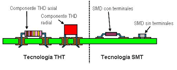

# sesion-07a
## Clase 210426

### pre-clase (teloneo Misaa)

Hoy comenzó la clase colocando a Manuel Gottsching que fue un compositor y guitarrista alemán considerado uno de los fundadores de la música electrónica contemporánea (mi sección favorita de la clase es cuando recomiendan musica, asi me motiva a seguir escuchando mejores cosas, conocer nuevos artistas y bueno, que mejor cuando te recomiendan, es una sensación cálida y qué mejor que venga de gente que sabe)

 

### clase

- Misaa

No pasamos materia como tal, pero sí nos dieron una mini introducción a kicad que comenzaremos a aprender la otra semana antes del receso, además de donde se realizarán nuestras PCB. Esta tienda se llama JBCPCB ( https://jlcpcb.com/ ) en china, Shenzhen.

Misaa nos enseñó sus proyectos nuevamente desde su página ( https://misaa.cc/index.html ) cada vez que lo busco en internet me lleva a páginas de la iglesia, misaa me va a terminar bendiciendo. Bueno, fue interesante volver a vernos y que pudiera entender algo de lo que estaba diciendo y mostrando, porque esto y por eso dije nuevamente, lo presentó las primeras clases y no se entendía nada. 

**SMT:** sistema de ensamblaje que consiste en una soldadura directa sobre el PCB sin necesidad de hacer agujeros previamente en la placa

**THT:** sistema de ensamblaje que consiste en insertar elementos con terminales metálicos a través de orificios perforados en la placa de circuito impreso (PCB), para luego soldarlos en el lado opuesto.

https://ammitechnologies.com/diferencias-montaje-smt-tht/

 

### imágenes de proceso

### post-clase

