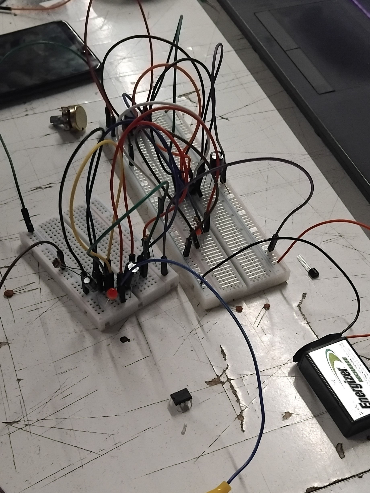
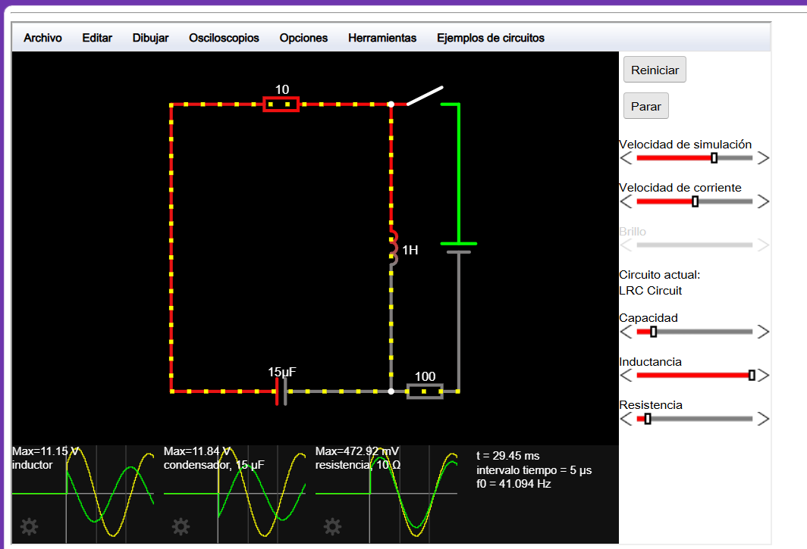
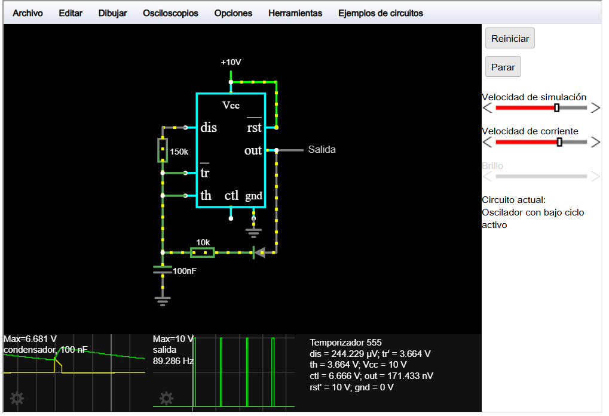
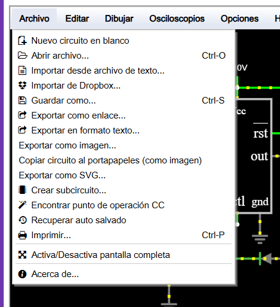

# sesion-04a #

## Apuntes ##

La clase inicio con un pequeño resumen / repaso sobre algunos términos y conceptos, donde lo que más destaco es la tabla con las potencias de 10 (la cual tengo en mi bitacora física pero no tan bonita como acá) 

|                           | Potencia de 10  | prefijo | abreviatura |
| ------------------------- | --------------- | ------- | ----------- |
| 1 000 000 000 000 000 000 | $10^{18}$       | Exa     | E           |
| 1 000 000 000 000 000     | $10^{15}$       | Peta    | P           |
| 1 000 000 000 000         | $10^{12}$       | Tera    | T           |
| 1 000 000 000             | $10^{9}$        | Giga    | G           |
| 1 000 000                 | $10^{6}$        | Mega    | M           |
| 1 000                     | $10^{3}$        | Kilo    | k           |
| 100                       | $10^{2}$        | Hecta   | h           |
| 10                        | $10^{1}$        | Deca    | da          |
| 1                         | $10^{0}$        |         |             |
| 0.1                       | $10^{-1}$       | deci    | d           |
| 0.01                      | $10^{-2}$       | centi   | c           |
| 0.001                     | $10^{-3}$       | mili    | m           |
| 0.000 001                 | $10^{-6}$       | micro   | µ           |
| 0.000 000 001             | $10^{-9}$       | nano    | n           |
| 0.000 000 000 001         | $10^{-12}$      | pico    | p           |
| 0.000 000 000 000 001     | $10^{-15}$      | femto   | f           |
| 0.00 000 000 000 000 001  | $10^{-18}$      | atto    | a           |

 

Lo siguiente que revisamos fue una variación del circuito anterior (Un Astable que se conectaba a un Monostable), donde se inicia con un Monostable que llega a un Astable.

1. Lo primero que debemos entender para llevar a cabo este circuito, es que hace cada uno
  
  a)  El Astable : En el output recibimos una corriente que alterna entre _on_ y _off_
 
  b)  El Monostable: Al presionar el interruptor la energía sigue circulando un tiempo desde que se suelta el switch.

2. Entonces para conectar el circuito _B_ al _A_ vamos a tomar el pin 3 del Monostable y conectarlo al pin _Reset_, es decir al n°4

3. Ahora cada vez que pulsemos el switch, la energía circula por un tiempo determinado donde el Astable, para luego emitir la corriente en ondas cuadradas hasta el parlante

> Una pequeña acotación es la particularidad del sonido, muy similar a como suena una ambulancia

 

### Falstad ###

Se nos enseño la web <https://www.falstad.com/circuit/>. Utilizada para visualizar de mejor manera que TinkerCad, ya que podemos ver como circula la energía en estas carreteras llamadas cables.

> Acá podemos ver como es la interfaz del sitio.
>
>> Abajo se pueden ver graficamente las ondas, en Inductores, condensadores, etc..
>>
>> Al lado se puede manipular aspectos de representación
>>
>> Arriba se observa todas las opciones disponibles

 

> En este apartado tenemos ejemplos de circuitos, opción bastante útil para aprender

 

> Este circuito es un ejemplo de un circuito _Oscilador con bajo ciclo activo_
>
> También se aprecia al mismisimo 555, pero con una _skin_ diferente (en la sesión anterior pudimos aprender esto)

 

> Ahora podemos apreciar las opciones para _Archivos_, donde destacan:
>
>> Exportar / Importar como formato de texto: Esto significa que mediante un mensaje podemos compartir diversos circuitos, sin necesidad de descargar un archivo
>>
>> Exportar como enlace: Formato más popular para compartir algo, pero el más volátil en mi opinión (esperemos que no desaparezca el servidor donde está el blog que tengo guardado hace 12 años xd)
>>
>> Exportar como SVG: Me parece fenomenal que exista esta opción, en cualquier momento estampo mi polera con el circuito _Atari Punk Console_
>>
>>> (Scalable Vector Graphics) es un formato de imagen vectorial basado en XML que permite escalar gráficos sin perder calidad ni pixelarse al ampliarlos.

 

> Ejemplo de como se ve el formato de texto

 

### Elementos a Investigar ###

Como es costumbre, dentro del bombardeo de preguntas que me surgen en clase hubo elementos que considero importantes rescatar:

1. Vimos los elementos internos del 555 y 
